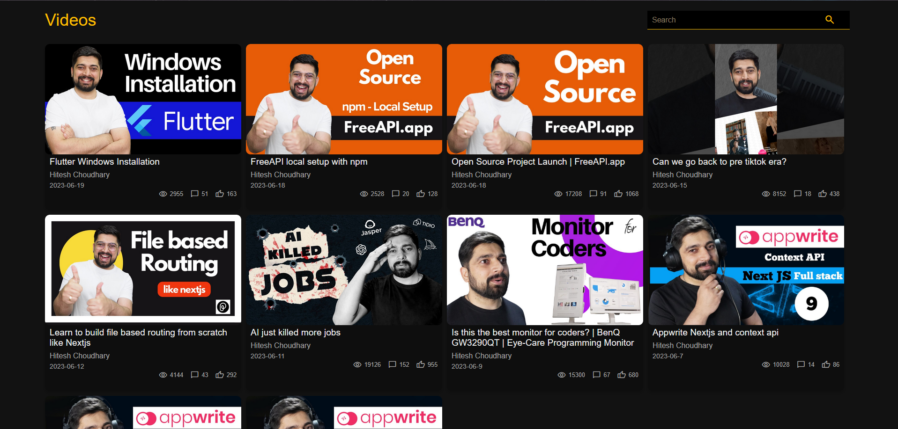
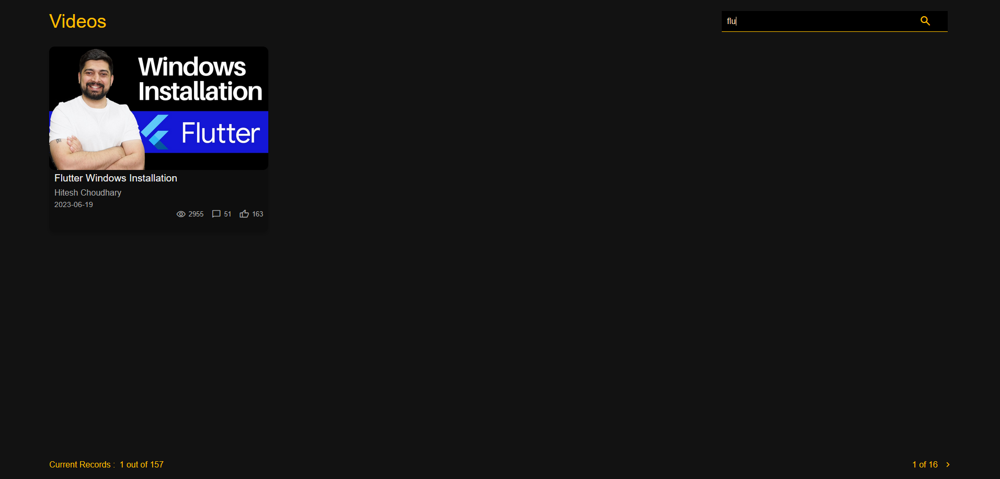

# About Youtube Video Clone App
## Introduction
Welcome to the Github repository for **Youtube Clone**. A simple Youtube video browser that allows users to view a list of Youtube videos, check their details, and navigate between pages. Users can also search for specific videos from the currently displayed results.
## Features
- **View Youtube Videos** - Users can visit the page, and browse through a list of Youtube videos. Each video is displayed as a card with relevant details.
- **Video Details** - Each video card displays: Video Thumbnail, Title, Channel Name, Publish Date, Like Count, Comment Count, & View Count.
- **Watch Videos on Youtube** - Clicking on a video card opens the video in a new tab on Youtube.
- **Pagination (Next & Previous Page)** - By Default, only 10 videos per page are displayed. User can navigate to the next or previous page (if available).
- **Search within the current page** - Users can search for a specific video within the 10 listed videos. Search works based on video title and channel name.
## How to Use
- Open the webpage.
- Browse the available Youtube videos.
- Click on any video to watch it on Youtube.
- Use Next/Previous buttons to navigate pages.
- Use the search bar to filter videos from the current page.
## Screenshots
Here's how the app looks:
- Home Page

- Search Bar

## Technologies used:
- HTML (Structure)
- CSS (Styling)
- JavaScirpt (Functionality & API Handling)